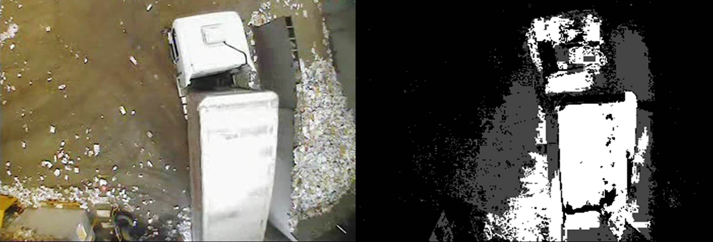
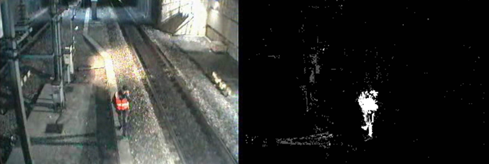

# Independent Multimodal Background Subtraction multi-thread
Independent Multimodal Background Subtraction multi-thread (IMBS-MT) Library is a C++ library designed for
performing an accurate foreground extraction in real-time. IMBS creates a multimodal model
of the background in order to deal with illumination changes, camera jitter, movements of 
small background elements, and changes in the background geometry. A statistical analysis 
of the frames in input is performed to obtain the background model. Bootstrap is required 
in order to build the initial background model. IMBS exploits OpenCV functions.

The video below shows foreground extraction using IMBS-MT Parallel Multi-modal Background Subtraction
on the [Town Centre Dataset] (http://www.robots.ox.ac.uk/ActiveVision/Research/Projects/2009bbenfold_headpose/project.html).
Darker gray pixels are considered as shadow points.

## Requirements

IMBS-MT requires the following packages to build:

* OpenCV (compatible with OpenCV 3.1)
* C++11

## How to build

IMBS-MT works under Linux, Mac Os and Windows environments. Please use the following command sequence to build 
the library:

### Linux & Mac Os

* mkdir build
* cd build
* cmake ../
* make -j

### Windows
* Use the CMake graphical user interface to create the desired makefile [CMake Homepage](https://cmake.org/)

## How to use

IMBS-MT is provided with an usage example (main.cpp)

### Linux

For video files:

_$./imbs-mt -vid data/video.avi_

For an image sequence (fps = 25 default value)

_$./imbs-mt -img data/0.jpg_

or you can specify the fps value

_$./imbs-mt -img data/0.jpg -fps 7_

### Windows

For video files

_>imbs-mt -vid data\video.avi_

For an image sequence (fps = 25 default value)

_>imbs-mt -img data\0.jpg_

or you can specify the fps value

_>imbs-mt -img data\0.jpg -fps 7_

## IMBS-MT webpage

You can find more information on IMBS-MT [here](http://www.dis.uniroma1.it/~bloisi/sw/imbs-mt.html).